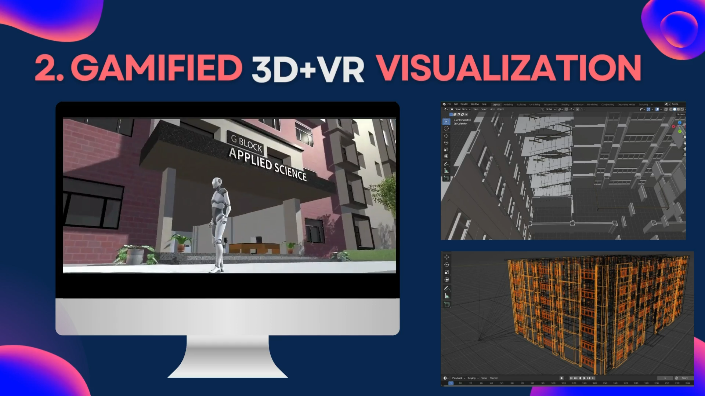

<!-- which  -->
# XplorAR - Remote Visualizer
 
1.Our idea provides 360° view of the institute through which user can see the aerial or the infrastructural view remotely.
2.We also provide gamified view through which user can visit virtually in the interior views of the institutions, malls and hospitals.

 
## INSTRUCTIONS TO USE OUR PROJECT

Our project is built on unity version 2021, which is a 3D/2D game engine and powerful cross-platform IDE for developers. And it is rendered using WebGL which is a JavaScript for rendering high-performance 2D and 3D graphics within any compatible web browser.

One can easily see the designs made using bleder and navigate in the interiors of the infrastructure by using A.S,W,D movements.

Things we have done in making this projects are:- 
->Designing the 3-D model on Blender  
->Adding third person camera follow and fbx file of 3D model in Unity  
->Deploying project on Webgl.  

## Demo
# [Project Link](https://thunderous-sherbet-80b45f.netlify.app/)

# FEATURES
 - ## **Feature 1:**   
  [ 360° View](https://orbix360.com/t/OFYPMIMh76hoqUEmXUrBTiHfPrw1/6462557812424704) ( Infrastructural View )

- ## **Feature 2:**  
  Gamified View (Interior View ).

## Contributors

- [Kapil Kumar Singh](https://github.com/kapilsingh2003)

## Accomplishments

**Event:**  [NASA Space Apps Challenge 2022](https://www.spaceappschallenge.org/)

**Position:** My Team 2:59 A.M secured [Global Finalist Honorable Mentions](https://2022.spaceappschallenge.org/awards/honorable-mentions/)

## Lessons Learned :  - [Deploying Unity Projects on webgl pages.](https://youtu.be/q8R3IkbaDso/)

